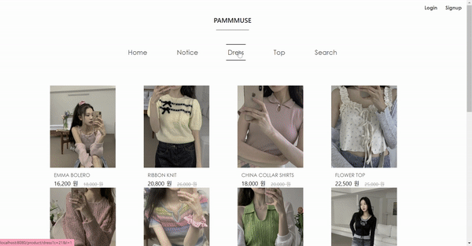

# Pammmuse

개인 프로젝트로 진행

여성의류 쇼핑몰입니다.

# Description

- 개발 기간: 2023.03 ~ 2023.05

- 사용 기술

  - SpringBoot 2.7.9,  Apache Tomcat 9.0, BootStrap,  Mybatis, AWS S3
  - Java 11,  Ajax,  Jquery, JavaScript,  Git,  MVC Pttern
  - MySQL DataBase

- 구현 내용

  - 메인 페이지 

  - 상품 카테고리 분류

  - 상품 검색

  - 상품 상세페이지 구현 (장바구니, 구매하기)

  - Spring Security를 이용한 로그인, 로그아웃, 회원가입, 소셜 로그인(카카오)

  - 회원정보 수정
  
  - 장바구니, 주문

  - 공지 게시판
  
-----------------------

  - **admin 사이트**
  
  - 관리자 로그인
  
  - 상품 등록, 삭제, 상세 조회
  
  - 공지 등록
  
  - 주문 현황, 주문 취소
  
    

# Views

- **메인**

  

- **상품 카테고리** 

  

- **상품 상세**

  

# Implementation

- #### 상품 카테고리

  
  

  - **카테고리별 페이징** 
    1. 카테고리 레벨을 나누어 @RequestParam을 통해 HTTP 요청 파라미터 값에 따라 카테고리를 구분 할 수 있도록 했습니다.
   

------

- #### 상품 상세보기

  

  - **장바구니, 구매하기 기능**

    1. 장바구니 클릭 시 선택한 상품이 장바구니 리스트에 등록됩니다. 그리고 등록완료 팝업창이 뜹니다. 
    2. 장바구니에 이미 추가되어 있는 경우, 로그인을 하지 않고 장바구니 등록을 한 경우 등 유효성 검사 후 팝업 알림.
    3. 구매하기 버튼 클릭 시 해당 상품과 같이 주문페이지로 이동.

  - **Navigation Bar**

    1. Bootstrap을 사용하여 메뉴 바를 구성하였고 버튼 클릭 시 해당 내용으로 이동할 수 있게 메뉴 바를 수정하였습니다. 

  - **상세정보**

    1. 상세정보에 나오는 이미지와 글씨는 DataBase에 저장된 내용을 그대로 추출하여 사용했습니다. 

       
------

- #### 상품 검색

  

  - **상품 키워드 검색**
    1. Mybatis 동적 쿼리문을 이용하여 상품명을 통한 키워드 검색, 리스트를 한번에 처리할 수 있도록 했습니다.
 

------

- # CRUD

  - **상품 등록 및 조회**
    1. 이미지 업로드는 AWS S3를 통하여 URL로 등록할 수 있도록 했습니다.
    
  - **주문 취소 업데이트**
    1. 주문 내역에서 주문을 취소하면 '배송 준비' 상태를 '주문 취소' 상태로 업데이트 할 수 있도록 했습니다.
    
  - **주문 완료 후 장바구니 삭제**
    1. 장바구니에서 주문을 완료한 경우 장바구니 내역이 삭제될 수 있도록 했습니다.
   

       

# Trouble Shooting 

